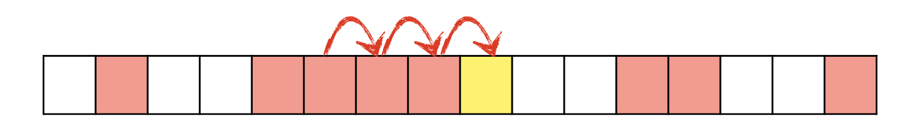
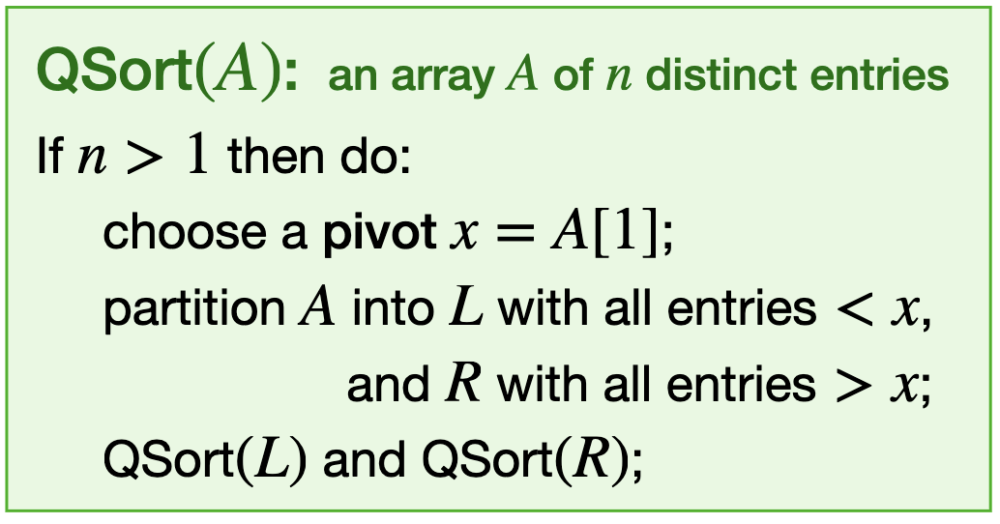

# 随机变量

## 随机变量与分布
定义在概率空间 $(\Omega, \Sigma, \Pr)$ 上的随机变量是一个函数
$$
X: \Omega \to \mathbb{R}
$$
并满足
$$
\forall x \in \mathbb{R}, \{\omega \in \Omega : X(\omega) \le x\} \in \Sigma
$$
也就是说，$X$ 是 $\Sigma$-可测的。

对离散随机变量 $X: \Omega \to \mathbb{Z}$，这意味着任意形如
$$
\{X \in S\}, \quad S \subseteq \mathbb{Z}
$$
的事件都是可测的。

**例**

掷一个骰子，令 $X$ 为朝上的点数；再令 $Y \in \{0, 1\}$ 表示结果是否为奇数。$X$ 与 $Y$ 都是同一样本空间上的随机变量，但它们携带的信息量不同。

**定义 CDF**

$X$ 的累积分布函数定义为
  $$
F_X(x) = \Pr(X \le x)
$$

若随机变量 $X$ 与 $Y$ 满足
$$
F_X = F_Y
$$

CDF 的基本性质：
$$
\begin{aligned}
& x \le y \Rightarrow F_X(x) \le F_X(y) \\
& \lim_{x \to -\infty} F_X(x) = 0 \\
& \lim_{x \to +\infty} F_X(x) = 1
\end{aligned}
$$

## 离散与连续随机变量
**定义 离散随机变量**

若 $X(\Omega)$ 可数，则称 $X$ 为离散随机变量。其概率质量函数为
  $$
p_X(x) = \Pr(X = x)
$$
  以及
  $$
F_X(y) = \sum_{x \le y} p_X(x)
$$

**定义 连续随机变量**

若存在可积密度函数 $f_X$ 使得
  $$
F_X(y) = \Pr(X \le y) = \int_{-\infty}^y f_X(x) \, dx
$$

**注**

存在既不是离散型也不是连续型的随机变量。

## 独立性与随机向量
若对任意 $x, y \in \mathbb{R}$，事件 $X \le x$ 与 $Y \le y$ 都独立，则称随机变量 $X$ 与 $Y$ 独立。

对离散随机变量，这等价于
$$
\Pr(X = x \cap Y = y) = \Pr(X = x) \Pr(Y = y)
$$
对所有 $x, y$ 都成立。

对随机变量 $X_1, \dots, X_n$，相互独立是指
$$
\Pr(X_1 = x_1 \cap \dots \cap X_n = x_n) = p_{X_1}(x_1) \dots p_{X_n}(x_n)
$$
对任意取值都成立。

**定义 随机向量**

随机向量是一个 $n$ 元组
  $$
X = (X_1, \dots, X_n)
$$
  其中每个 $X_i$ 都是随机变量。它的联合 CDF 为
  $$
F_X(x_1, \dots, x_n) = \Pr(X_1 \le x_1 \cap \dots \cap X_n \le x_n)
$$

对离散随机向量，其联合 pmf 为
$$
p_X(x_1, \dots, x_n) = \Pr(X_1 = x_1 \cap \dots \cap X_n = x_n)
$$
边缘分布可通过对其余坐标求和得到。

**两两独立的一个例子**

如何从相互独立的随机比特中构造出 $2^n - 1$ 个两两独立的随机比特？一个标准做法是用异或来组合。

  也就是说，当 $n \approx 2^k$ 时，我们希望生成 $I_i \in \{0, 1\}, i \in [n]$，满足
  $$
\Pr(I_i = 1) = 1/2
$$
  并且 $I_i$ 两两独立。存在一个 $\Theta(n)$ 的构造算法：
  依次生成 $k$ 位随机比特：
  $X := \underbrace{000 \dots 00}_{k \text{bits}} \to 111\dots11$
  $B_{i, j}$ 表示整数 $i$ 的二进制表示中的第 $j$ 位。
  $$
I_i := \bigoplus_{B_{i, j} = 1} B(X, j)
$$

# 离散分布

## Bernoulli 试验
**定义 Bernoulli 分布**

Bernoulli 随机变量只取值于 $\{0, 1\}$，并满足
  $$
p_X(1) = p, \quad p_X(0) = 1 - p
$$
  其中 $p \in [0, 1]$。

对事件 $A$，其指示随机变量定义为
$$
\begin{aligned}
& I(A) = 1, \text{若} A \text{发生} \\
& I(A) = 0, \text{否则}
\end{aligned}
$$
它是参数为 $\Pr(A)$ 的 Bernoulli 随机变量。

## 二项分布
**定义 二项分布**

若 $X$ 表示 $n$ 次参数为 $p$ 的 i.i.d. Bernoulli 试验中的成功次数，则
  $$
p_X(k) = \Pr(X = k) = \binom{n}{k} p^k (1-p)^{n-k}, \quad k = 0, 1, \dots, n
$$
  记作 $X \sim \text{Bin}(n, p)$。

**注**

也可以写成
  $$
X = X_1 + \dots + X_n
$$
  其中 $X_1, \dots, X_n$ 是独立同分布的 Bernoulli 随机变量。

## 几何分布
**定义 几何分布**

若 $X$ 表示得到第一次成功所需的 Bernoulli 试验次数，则
  $$
p_X(k) = \Pr(X = k) = (1-p)^{k-1} p, \quad k = 1, 2, \dots
$$
  记作 $X \sim \text{Geo}(p)$。

**无记忆性**

若 $X \sim \text{Geo}(p)$，则对任意 $k \ge 1$ 和 $n \ge 0$，都有
  $$
\Pr(X = k + n | X > n) = \Pr(X = k)
$$

  证明。
  $$
\begin{aligned}
\Pr(X = k + n | X > n) & = \Pr(X = k + n) / \Pr(X > n) \\
& = ((1-p)^{n+k-1} p) / ((1-p)^n) \\
& = (1-p)^{k-1} p = \Pr(X = k)
\end{aligned}
$$

**注**

几何分布是定义在 $\{1, 2, \dots\}$ 上唯一具有离散无记忆性的分布。

## 独立随机变量之和
若离散随机变量 $X$ 与 $Y$ 独立，则
$$
p_{X+Y}(z) = \sum_x \Pr(X = x \cap Y = z - x) = \sum_x p_X(x) p_Y(z - x)
$$
这就是两个质量函数的卷积：
$$
p_{X+Y} = p_X * p_Y
$$

**证明**

对 i.i.d. Bernoulli 随机变量 $X_1, \dots, X_n$，
  $$
\begin{aligned}
p_{X_1 + \dots + X_n}(k) & = p \cdot p_{X_1 + \dots + X_{n-1}}(k-1) + (1-p) \cdot p_{X_1 + \dots + X_{n-1}}(k) \\
& = \binom{n-1}{k-1} p^k (1-p)^{n-k} + \binom{n-1}{k} p^k (1-p)^{n-k} \\
& = \binom{n}{k} p^k (1-p)^{n-k}
\end{aligned}
$$

## 负二项分布
**定义 负二项分布**

令 $X$ 表示在 i.i.d. Bernoulli 试验中，第 $r$ 次成功之前失败的次数，则
  $$
p_X(k) = \Pr(X = k) = \binom{k + r - 1}{k} (1-p)^k p^r, \quad k = 0, 1, 2, \dots
$$

此外，
$$
X = (X_1 - 1) + \dots + (X_r - 1)
$$
其中 $X_1, \dots, X_r$ 是参数为 $p$ 的 i.i.d. 几何随机变量。

## 超几何分布
**定义 超几何分布**

设总体中共有 $N$ 个对象，其中恰有 $M$ 个是“成功”，从中不放回抽取 $n$ 次，令 $X$ 为成功次数，则
  $$
p_X(k) = \Pr(X = k) = (\binom{M}{k} \binom{N-M}{n-k}) / \binom{N}{n}
$$

## 多项分布
**定义 多项分布**

将 $n$ 个球独立投入 $m$ 个盒子，其中第 $i$ 个盒子被选中的概率为 $p_i$，并且
  $$
p_1 + \dots + p_m = 1
$$
  若 $X_i$ 表示第 $i$ 个盒子中的球数，则
  $$
\Pr(X_1 = k_1 \cap \dots \cap X_m = k_m) = n! / (k_1! \dots k_m!) p_1^{k_1} \dots p_m^{k_m}
$$
  其中 $k_1 + \dots + k_m = n$。

每个边缘分布都满足
$$
X_i \sim \text{Bin}(n, p_i)
$$

## Poisson 分布
**定义 Poisson 分布**

参数为 $\lambda > 0$ 的 Poisson 随机变量满足
  $$
p_X(k) = \Pr(X = k) = \exp(-\lambda) \lambda^k / k!, \quad k = 0, 1, 2, \dots
$$

**Poisson 作为二项分布极限**

若 $n \to \infty$ 且 $n p = \lambda$，则
  $$
\text{Bin}(n, \lambda / n)(k) = \binom{n}{k} (\lambda / n)^k (1 - \lambda / n)^{n-k} \approx \exp(-\lambda) \lambda^k / k!
$$
  因此在稀疏极限下，Poisson 分布可以视为二项分布的理想化极限。

**Poisson 变量之和**

若 $X \sim \text{Pois}(\lambda_1)$ 与 $Y \sim \text{Pois}(\lambda_2)$ 相互独立，则
  $$
\begin{aligned}
p_{X+Y}(k) & = \sum_{i=0}^k p_X(i) p_Y(k-i) \\
& = \sum_{i=0}^k \exp(-\lambda_1) \lambda_1^i / i! \exp(-\lambda_2) \lambda_2^{k-i} / (k-i)! \\
& = \exp(-(\lambda_1 + \lambda_2)) / k! \sum_{i=0}^k \binom{k}{i} \lambda_1^i \lambda_2^{k-i} \\
& = \exp(-(\lambda_1 + \lambda_2)) (\lambda_1 + \lambda_2)^k / k!
\end{aligned}
$$
  因此
  $$
X + Y \sim \text{Pois}(\lambda_1 + \lambda_2)
$$

**球入盒模型中的 Poisson 近似**

若 $(X_1, \dots, X_m)$ 服从参数为 $(n, p_1, \dots, p_m)$ 的多项分布，且 $Y_1, \dots, Y_m$ 相互独立并满足
  $$
Y_i \sim \operatorname{Pois}(\lambda_i), \qquad \lambda_i = n p_i,
$$
  则 $(X_1, \dots, X_m)$ 的分布与在条件 $\sum_{i=1}^m Y_i = n$ 下的 $(Y_1, \dots, Y_m)$ 相同。

  证明。
  $$
\sum_{i=1}^m Y_i \sim \operatorname{Pois}\!\left(\sum_{i=1}^m \lambda_i\right) = \operatorname{Pois}(n)
$$
  $$
\begin{aligned}
& \Pr(Y_1 = y_1, \dots, Y_m = y_m \mid \sum_{i=1}^m Y_i = n) \\
= {} & \frac{\Pr(Y_1 = y_1, \dots, Y_m = y_m)}{\Pr(\sum_{i=1}^m Y_i = n)} \\
= {} & \frac{\prod_{i=1}^m e^{-\lambda_i}\lambda_i^{y_i}/y_i!}{e^{-n} n^n / n!} \\
= {} & \frac{n!}{y_1! \cdots y_m!} \prod_{i=1}^m p_i^{y_i}
\end{aligned}
$$
  这里用到了 $\sum_{i=1}^m y_i = n$ 以及 $\sum_{i=1}^m \lambda_i = n$。上式恰好就是多项分布在 $(y_1, \dots, y_m)$ 处的概率，因此结论成立。

## 随机对象
**例**

在球入盒模型中，$(X_1, \dots, X_m)$ 服从参数为 $(m, n, (1/m, \dots, 1/m))$ 的多项分布。

**例**

在 Erdős-Rényi 随机图 $G(n, p)$ 中，边数服从
  $$
\text{Bin}(\binom{n}{2}, p)
$$

**例**

在 Galton-Watson 分枝过程中，
  $$
X_{n+1} = \sum_{j=1}^{X_n} \xi_j^{n}
$$
  其中后代变量 $\xi_j^n$ 是独立同分布的非负整数值随机变量。

## 期望

## 定义
对离散随机变量 $X$，其期望定义为
$$
\mathbb{E}[X] = \sum_x x p_X(x)
$$
这里假设 $\mathbb{E}[X] < \infty$。

**圣彼得堡悖论**

$$
p_{X}(2^k) = 2^{-k}, k = 1, 2, 3\dots \Rightarrow \mathbb{E}[X] = \infty
$$

## 指示变量的期望
对参数为 $p$ 的 Bernoulli 随机变量，
$$
\mathbb{E}[X] = p
$$
特别地，对指示变量有
$$
\mathbb{E}[I(A)] = \Pr(A)
$$

## Poisson 分布的期望
对 $X \sim \text{Pois}(\lambda)$，
$$
\begin{aligned}
\mathbb{E}[X] & = \sum_{k \ge 0} k \exp(-\lambda) \lambda^k / k! \\
& = \lambda \sum_{k \ge 1} \exp(-\lambda) \lambda^{k-1} / (k-1)! \\
& = \lambda
\end{aligned}
$$

## 变量替换
**无意识统计学家定律（LOTUS）**

对函数 $f: \mathbb{R} \to \mathbb{R}$ 和离散随机变量 $X$，
  $$
\mathbb{E}[f(X)] = \sum_x f(x) p_X(x)
$$

  更一般地，对离散随机向量 $X = (X_1, \dots, X_n)$，
  $$
\mathbb{E}[f(X_1, \dots, X_n)] = \sum_{x_1, \dots, x_n} f(x_1, \dots, x_n) p_X(x_1, \dots, x_n)
$$

## 期望的线性性
对随机变量 $X, Y$ 及标量 $a, b$，
$$
\mathbb{E}[a X + b] = a \mathbb{E}[X] + b
$$
$$
\mathbb{E}[X + Y] = \mathbb{E}[X] + \mathbb{E}[Y]
$$

**注**

这条结论与 $X$、$Y$ 是否独立无关。

对任意仿射函数（或线性函数）$f$，
$$
\mathbb{E}[f(X_1, \dots, X_n)] = f(\mathbb{E}[X_1], \dots, \mathbb{E}[X_n])
$$

## 基本分布的期望
**二项分布的期望**

若 $X \sim \text{Bin}(n, p)$，且
  $$
X = X_1 + \dots + X_n
$$
  其中 $X_i$ 是 i.i.d. Bernoulli 变量，则由线性性
  $$
\mathbb{E}[X] = \mathbb{E}[X_1] + \dots + \mathbb{E}[X_n] = n p
$$

**几何分布的期望**

对 $X \sim \text{Geo}(p)$，记
  $$
X = \sum_{k \ge 1} I_k
$$
  其中 $I_k$ 表示前 $k-1$ 次试验全部失败。则
  $$
\mathbb{E}[X] = \sum_{k \ge 1} \mathbb{E}[I_k] = \sum_{k \ge 1} (1-p)^{k-1} = 1 / p
$$

**负二项分布的期望**

对负二项分布的期望，
  $$
X = \sum_{k\ge1} k \binom{k+r-1}{k} (1-p)^k p^r
$$
  $$
X = (X_1 - 1) + \dots + (X_r - 1), X_i \sim \operatorname{Geo}(p)
$$
  其中 $X_i \sim \text{Geo}(p)$ 且相互独立，则
  $$
\mathbb{E}[X] = r \mathbb{E}[X_1] - r = r (1-p) / p
$$

**超几何分布的期望**

令 $X$ 表示抽到的红球数。若 $X_i$ 表示第 $i$ 个红球是否被抽到，则
  $$
X = X_1 + \dots + X_M
$$
  每个红球被抽到的概率都是 $n / N$。因此
  $$
\mathbb{E}[X] = \mathbb{E}[X_1] + \dots + \mathbb{E}[X_M] = n M / N
$$

## 模式匹配与集邮券问题
**模式匹配**

设 $s = (s_1, \dots, s_n) \in Q^n$ 是字母表 $Q$ 上的均匀随机串，且 $\lvert Q \rvert = q$。对固定模式 $\pi \in Q^k$，令 $X$ 为 $\pi$ 作为子串出现的次数。

  若 $I_i$ 表示
  $$
\pi = (s_i, s_{i+1}, \dots, s_{i+k-1})
$$
  那么
  $$
X = \sum_{i=1}^{n-k+1} I_i
$$
  因而
  $$
\mathbb{E}[X] = \sum_{i=1}^{n-k+1} \mathbb{E}[I_i] = (n-k+1) q^{-k}
$$

**集邮券问题**

令 $X$ 表示收集到全部 $n$ 种优惠券之前需要打开的盒子数。将其分解为
  $$
X = X_1 + \dots + X_n
$$
  其中 $X_i$ 表示当前已收集恰好 $i-1$ 种时，还需等待多久才能得到新种类。

  此时 $X_i$ 服从参数为
  $$
p_i = (n-i+1) / n
$$
  的几何分布，因此
  $$
\mathbb{E}[X] = \sum_{i=1}^n \mathbb{E}[X_i] = \sum_{i=1}^n n / (n-i+1) = n \sum_{i=1}^n 1 / i \approx n \ln n
$$

## 双计数恒等式
对任意取值于 $\{0, 1, 2, 3, \dots\}$ 的非负整数值随机变量 $X$，都有
$$
\mathbb{E}[X] = \sum_{k \ge 0} \Pr(X > k)
$$

**证明**

方法一：

  记 $I_k$ 为事件 $X > k$ 的指示变量，则
  $$
X = \sum_{k \ge 0} I_k
$$
  由期望的线性性，
  $$
\mathbb{E}[X] = \sum_{k \ge 0} \mathbb{E}[I_k] = \sum_{k \ge 0} \Pr(X > k)
$$

  方法二：
  $$
\begin{aligned}
\mathbb{E}[X] & = \sum_{x \ge 0} x \Pr(X = x) = \sum_{x \ge 0} \sum_{k=0}^{x-1} \Pr(X = x) \\
& = \sum_{k \ge 0} \sum_{x > k} \Pr(X = x) = \sum_{k>0} \Pr(X > k)
\end{aligned}
$$

## 线性性的应用
**开放寻址中的不成功查找**

  哈希函数 $h: U \to [m]$，将来自
  全集 $U$ 的 $n$ 个键映射到 $m$ 个槽位中。

  开放寻址法通过探测策略来解决哈希冲突。
  当查找某个键 $x \in U$ 时，第 $i$ 次探测的
  槽位由 $h(x, i)$ 给出。
  - 线性探测：$h(x, i) = h(x) + i \pmod m$
  - 二次探测：$h(x, i) = h(x) + c_1 i + c_2 i^2 \pmod m$
  - 双重散列：$h(x, i) = h_1(x) + i h_2(x) \pmod m$
  - 均匀散列：$h(x, i) = \pi(i)$，其中 $\pi$ 是 $[m]$ 上的均匀随机排列。

  在装载因子为 $\alpha = n / m$ 的哈希表中，若采用均匀散列，令 $X$ 表示一次不成功查找所需的探测次数，则
  $$
\mathbb{E}[X] = 1 + \sum_{k \ge 1} \Pr(X > k)
$$

  记 $A_i$ 为“第 $i$ 次探测到的槽位已被占用”这一事件。由链式法则，
  $$
\Pr(X > k) = \Pr(\bigcap_{i=1}^k A_i) = \prod_{i=1}^k \Pr(A_i | \bigcap_{j < i} A_j)
$$
  以及
  $$
\Pr(A_i | \bigcap_{j < i} A_j) = (n - i + 1) / (m - i + 1) \le \alpha
$$
  因而
  $$
\mathbb{E}[X] \le 1 + \sum_{k \ge 1} \alpha^k = 1 / (1 - \alpha)
$$

**用指示变量证明容斥原理**

由于
  $$
I(A^c) = 1 - I(A), \quad I(A \cap B) = I(A) I(B)
$$
  可得
  $$
I(\bigcup_{i=1}^n A_i) = 1 - \prod_{i=1}^n (1 - I(A_i))
$$
  将乘积展开可得
  $$
I(\bigcup_{i=1}^n A_i) = \sum_{\emptyset \ne S \subseteq [n]} (-1)^{|S|-1} I(\bigcap_{i \in S} A_i)
$$
  两边取期望，就得到通常的容斥公式。

## Boole-Bonferroni 不等式
对事件 $A_1, A_2, \dots, A_n$，
$$
\begin{aligned}
I(\bigcup_{i=1}^n A_i) & = 1 - \prod_{i=1}^n (1 - I(A_i)) \\
& = \sum_{\emptyset \ne S \subseteq [n]} (-1)^{|S|-1} I(\bigcap_{i \in S} A_i) \\
& = \sum_{k=1}^n (-1)^{k-1} \sum_{S \in \binom{\{1, \dots, n\}}{k}} I(\bigcap_{i \in S} A_i)
\end{aligned}
$$
观察：
$$
\begin{aligned}
X_k & := \binom{\sum_{i = 1}^n I(A_i)}{k} \\
& = \sum_{S \in \binom{\{1, \dots, n\}}{k}} \prod_{i \in S} I(A_i) \\
& = \sum_{S \in \binom{\{1, \dots, n\}}{k}} I(\bigcap_{i \in S} A_i)
\end{aligned}
$$
$X_k$在每个$\sum_i I(A_i) = m$下都是$\binom{m}{k}$,利用杨辉三角, 组合数可以被分解为上一行的两个, 偶数最终是上一行头减去尾, 奇数是加上尾.
$$
\sum_{k \le 2 t} (-1)^{k-1} X_k \le \sum_{k=1}^n (-1)^{k-1} X_k \le \sum_{k \le 2t + 1} (-1)^{k-1} X_k
$$
求均值证毕.

## 线性性的局限
**注**

对无穷求和，
  $$
\mathbb{E}[\sum_{i=1}^\infty X_i] = \sum_{i=1}^\infty \mathbb{E}[X_i]
$$
  需要绝对收敛。

  对随机个数的随机变量之和，
  $$
\mathbb{E}[\sum_{i=1}^N X_i] = \mathbb{E}[N] \mathbb{E}[X_1]
$$
  若无额外假设，这个等式一般并不成立。

## 条件期望

对离散随机变量 $X$ 与满足 $\Pr(A) > 0$ 的事件 $A$，定义
$$
\mathbb{E}[X | A] = \sum_x x \Pr(X = x | A)
$$
这里默认级数绝对收敛。

条件 pmf 为
$$
p_{X|A}(x) = \Pr(X = x | A)
$$
并且 $\mathbb{E}[X | A]$ 仍满足通常的线性性质。

## 全期望公式
若 $B_1, \dots, B_n$ 构成 $\Omega$ 的一个划分，则
$$
\mathbb{E}[X] = \sum_{i=1}^n \mathbb{E}[X | B_i] \Pr(B_i)
$$

**证明**

由全概率公式，
  $$
\Pr(X = x) = \sum_{i=1}^n \Pr(X = x | B_i) \Pr(B_i)
$$
  因此
  $$
\begin{aligned}
\mathbb{E}[X] & = \sum_x x \Pr(X = x) \\
& = \sum_x x \sum_{i=1}^n \Pr(X = x | B_i) \Pr(B_i) \\
& = \sum_{i=1}^n \Pr(B_i) \sum_x x \Pr(X = x | B_i) \\
& = \sum_{i=1}^n \mathbb{E}[X | B_i] \Pr(B_i)
\end{aligned}
$$

## 给定随机变量的条件期望
对随机变量 $X$ 和 $Y$，条件期望 $\mathbb{E}[X | Y]$ 是随机变量 $f(Y)$，其中
$$
f(y) = \mathbb{E}[X | Y = y]
$$

这一定义自然可推广到 $\mathbb{E}[X | Y, Z]$，并满足塔式性质
$$
\mathbb{E}[\mathbb{E}[X | Y]] = \mathbb{E}[X]
$$

## 条件期望的应用
**快速排序（QuickSort）**

  令 $X_n$ 为快速排序在 $n$ 个不同元素的均匀随机排列上所进行的比较次数，并记
  $$
t(n) = \mathbb{E}[X_n]
$$
  若 $B_i$ 表示第一个元素恰好是第 $i$ 小的事件，则
  $$
\begin{aligned}
t(n) & = \sum_{i=1}^n \mathbb{E}[X_n | B_i] \Pr(B_i) \\
& = 1 / n \sum_{i=1}^n \mathbb{E}[n - 1 + X_{i-1} + X_{n-i}] \\
& = n - 1 + 2 / n \sum_{i=0}^{n-1} t(i)
\end{aligned}
$$
  其中 $t(0) = t(1) = 0$。

**快速排序的另一种证明**

设 $A$ 是 $a_1 < a_2 < \dots < a_n$ 的一个排列。

  令 $X_{i j}$ 表示 $a_i$ 与 $a_j$ 在快速排序过程中是否被比较。

  观察 1：每一对元素最多只会比较一次。于是
  $$
X = \sum_{i<j} X_{i j}
$$
  观察 2：如果 $a_i, a_j$ 仍位于同一个子数组中，那么所有满足 $i < k < j$ 的 $a_k$ 也都在该子数组中。

  因此，$a_i$ 与 $a_j$ 会被比较，当且仅当它们还处在同一个子数组里，并且在集合
  $$
\{a_i, a_{i+1}, \dots, a_j\}
$$
  中最先被选作 pivot 的元素恰好是 $a_i$ 或 $a_j$。
  因此
  $$
\mathbb{E}[X_{i j}] = 2 / (j - i + 1)
$$
  于是由线性性
  $$
\begin{aligned}
\mathbb{E}[X]
& = \sum_{i<j} \frac{2}{j - i + 1} \\
& = \sum_{i = 1}^n \sum_{k=2}^{n-i+1} \frac{2}{k} \\
& \le 2 n \sum_{k=1}^n \frac{1}{k} \\
& = 2 n \ln n + O(n)
\end{aligned}
$$

**随机家族树**

在 Galton-Watson 过程中，若每个个体的后代均值为
  $$
\mu = \mathbb{E}[\xi_j^{n}]
$$
  则有
  $$
\mathbb{E}[X_n | X_{n-1} = k] = \mathbb{E}[\sum_{j=1}^k \xi_j^{n-1}] = k \mu
$$
  因此
  $$
\mathbb{E}[X_n | X_{n-1}] = \mu X_{n-1}
$$
  再由塔式性质
  $$
\mathbb{E}[X_n] = \mu \mathbb{E}[X_{n-1}] = \dots = \mu^n
$$

  因此，
  $$
\mathbb{E}[\sum_{n=0}^\infty X_n] = \sum_{n=0}^\infty \mu^n
$$
  当 $0 < \mu < 1$ 时，它等于 $1 / (1 - \mu)$；当 $\mu \ge 1$ 时，它发散到 $+\infty$。

## Jensen 不等式
若 $f$ 是凸函数（下凸，如绝对值函数），则
$$
\mathbb{E}[f(X)] \ge f(\mathbb{E}[X])
$$
若 $f$ 是凹函数（如对数函数），则
$$
\mathbb{E}[f(X)] \le f(\mathbb{E}[X])
$$

## 期望的单调性
若 $X \le Y$ 几乎处处成立，则
$$
\mathbb{E}[X] \le \mathbb{E}[Y]
$$

**证明**

由于 $X \le Y$ 几乎处处成立，所以
  $$
\Pr(X \le Y) = 1
$$
  因此
  $$
\Pr((X, Y) = (x, y)) = 0, \qquad x > y
$$
  也就是说，只要 $x > y$，联合概率就为 $0$。

  因此
  $$
\begin{aligned}
\mathbb{E}[X] & = \sum_x x \Pr(X = x) \\
& = \sum_x x \sum_y \Pr((X, Y) = (x, y)) \\
& = \sum_x x \sum_{y \ge x} \Pr((X, Y) = (x, y))
\end{aligned}
$$

  由于当 $y \ge x$ 时必有 $x \le y$，于是
  $$
\begin{aligned}
\mathbb{E}[X] & \le \sum_y y \sum_{x \le y} \Pr((X, Y) = (x, y)) \\
& = \sum_y y \Pr(Y = y) \\
& = \mathbb{E}[Y]
\end{aligned}
$$

特别地，若 $X \le c$ 几乎处处成立，则
$$
\mathbb{E}[X] \le c
$$
若 $X \ge c$ 几乎处处成立，则
$$
\mathbb{E}[X] \ge c
$$

另外，由于
$$
-\lvert X \rvert \le X \le \lvert X \rvert
$$
几乎处处成立，由单调性可得
$$
-\mathbb{E}[\lvert X \rvert] \le \mathbb{E}[X] \le \mathbb{E}[\lvert X \rvert]
$$
因此
$$
\lvert \mathbb{E}[X] \rvert \le \mathbb{E}[\lvert X \rvert]
$$
特别地，
$$
\mathbb{E}[\lvert X \rvert] \ge \lvert \mathbb{E}[X] \rvert \ge 0
$$

## 平均值原理
若 $\Pr(X < c) = 1$，则 $\mathbb{E}[X] < c$。

**证明**

假设 $\Pr(X < c) = 1$ 意味着
  $$
X < c
$$
  几乎处处成立。特别地，
  $$
X \le c
$$
  几乎处处成立，因此由单调性
  $$
\mathbb{E}[X] \le c
$$

逆否地，
$$
\Pr(X \ge \mathbb{E}[X]) > 0
$$
同理，
$$
\Pr(X \le \mathbb{E}[X]) > 0
$$

**注**

这就是最朴素的概率方法：如果不存在结果满足
  $$
X(\omega) \ge \mathbb{E}[X]
$$
  那么就有 $X < \mathbb{E}[X]$ 几乎处处成立，这与前述结论矛盾。

  因此必然存在某个结果 $\omega \in \Omega$ 使得
  $$
X(\omega) \ge \mathbb{E}[X]
$$
  同理，也存在某个结果使得
  $$
X(\omega) \le \mathbb{E}[X]
$$

## 最大割
**随机化存在性证明**

对无向图 $G(V, E)$，令每个顶点独立地以概率 $1 / 2$ 加入集合 $S$。对每条边 $\{u, v\} \in E$，记
  $$
I_{u v} = I(Y_u \ne Y_v)
$$
  表示这条边是否跨越该割。于是
  $$
\lvert \delta S \rvert = \sum_{\{u, v\} \in E} I_{u v}
$$
  以及
  $$
\mathbb{E}[\lvert \delta S \rvert] = \sum_{\{u, v\} \in E} \Pr(Y_u \ne Y_v) = \lvert E \rvert / 2
$$
  因此必然存在一个割，其大小至少为 $\lvert E \rvert / 2$。
